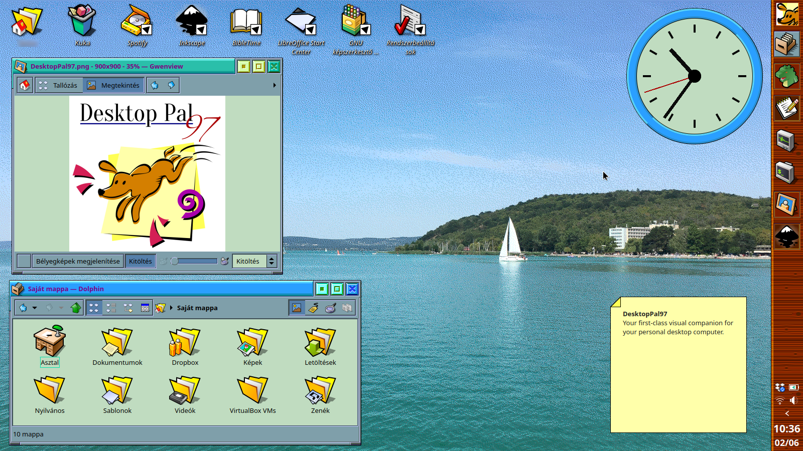

# DesktopPal97

*"Your first-class visual companion for your personal desktop computer."*

DesktopPal97 is a rebellious yet classic fantasy desktop imitating the 90s aesthetic.
It is a full-featured theme for KDE Plasma, including the Global Theme, a customized lockscreen and logout screens, a Plasma Theme, an Aurorae theme, a Kvantum theme, and an SDDM theme. Even a custom KWin Overview effect and a KWin Windowview effect are available.

A proper GTK3/4 theme is missing, but any contribution is welcome. However, it looks quite decent with the default Breeze GTK theme, too.

DesktopPal97 takes its inspiration from the desktop GUIs from the 1990s and 2000s (e.g., KDE2), and it uses the 256-color VGA palette.

## Theme details

:cd: Global theme: [DesktopPal97](https://www.pling.com/p/1985239/)

:cd: Plasma theme: [DesktopPal97](https://www.pling.com/p/1985233/)

:cd: Color scheme: [DesktopPal97](https://www.pling.com/p/1985230/)

:cd: Widget style: [DesktopPal97](https://www.pling.com/p/1985234/) (Kvantum)

:cd: Window decoration: [DesktopPal97](https://www.pling.com/p/1985232/) (inspired by the KDE2 window decoration)

:cd: SDDM: [DesktopPal97](https://www.pling.com/p/1985237/)

:cd: Icon theme: [RetroSmart (modified)](https://github.com/mdomlop/retrosmart-icon-theme)

:cd: Font: Noto Sans (Kubuntu default)

:cd: Cursor theme: [Simp1e Dark](https://www.pling.com/p/1932768)

:cd: Wallpaper: [Balaton](https://www.pling.com/p/1985236/) (default DesktopPal97 wallpaper)

## Hacks & extra customizations

:cd: Custom KWin Overview effect: copy "overview" folder to "~/.local/share/kwin/effects"

:cd: Custom KWin Windowview effect: copy "windowview" folder to "~/.local/share/kwin/effects"

:cd: Firefox: force light mode. Go to "about:config" and change "ui.systemUsesDarkTheme" to 0

:cd: To make Simp1e cursor theme available in SDDM, copy the cursor theme folder to "root/usr/share/". Go to System Settings > Startup and Shutdown > Login Screen (SDDM) and click "Apply Plasma Settings...".

:cd: The width of the right-side panel is 64 pixel in the screenshot.

:cd: You might loose the shortcut of the Kickoff launcher widget when you apply the layout of the Global theme. To restore the shortcut (Meta button), go to Kickoff settings > Shortcuts > set the shortcut to Alt+F1.
